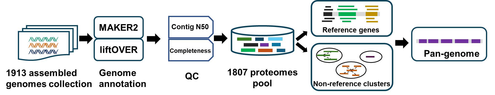
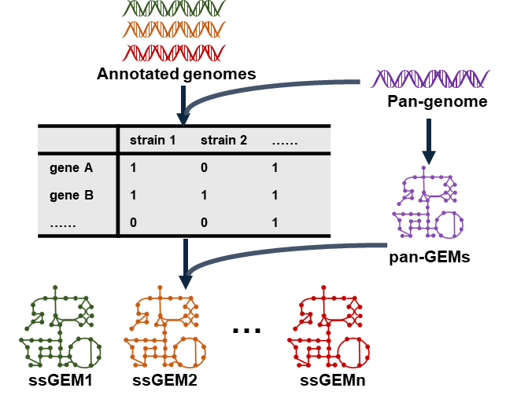

## Pan-genome and strain-specific genome-scale metabolic models of 1800 Saccharomyces cerevisiae strains
- Introduction:  
This repository contains the code and data used to generate the pan-genome and strain-specific genome-scale metabolic models of 1807 Saccharomyces cerevisiae strains.

- Pan-genome construction:

- ssGEMs reconstruction:

- Citation:    
Yeast adapts to diverse ecological niches driven by genomics and metabolic reprogramming
